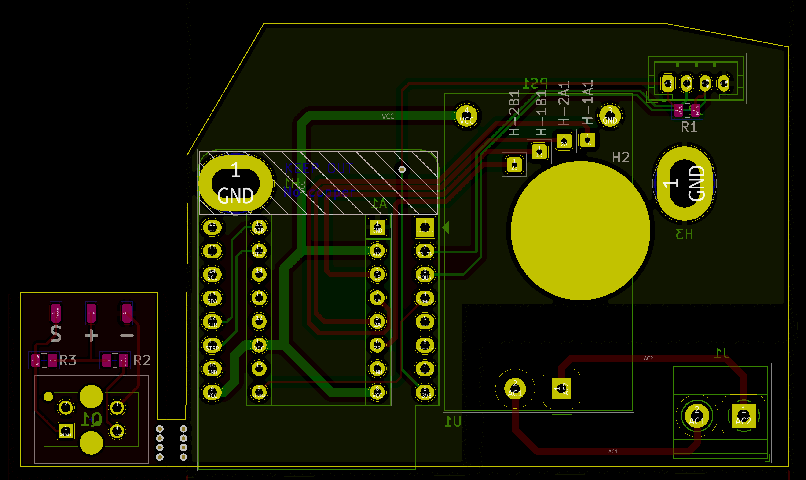
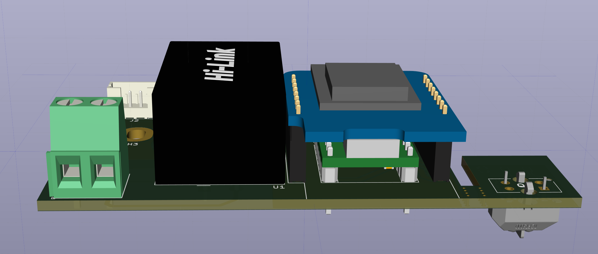

Bei dieser schönen 60er-Jahre Uhr war der Synchronmotor defekt (lief nur
selten an, Versatz von 2h pro Tag). Ein Ersatz für diesen war nicht zu
finden, daher die High-Tech-Variante.

-   Synchronmotor durch Schrittmotor ersetzen

-   Zeit via NTP über einen ESP holen

-   Das Ganze so, dass es ein 1:1 Ersatz zu dem montierten Motor wird

# Herausforderungen

-   Einen Schrittmotor finden mit passendem Ritzel und passender Größe.

-   Der Schrittmotor mit passendem Ritzel ist für max. 5V ausgelegt, die
    üblichen StepSticks brauchen 8V.

-   Alles in das Gehäuse bekommen.

-   Erste Tests zeigten, dass für eine Minute eine unterschiedliche
    Anzahl an Schritten benötigt wird.

-   Keine Möglichkeit, das Umspringen der Minuten zu erkennen.

-   Spontane Abschaltungen bei Netzbetrieb.

# Lösungen

## Schrittmotor

AliExpress sei Dank: [Stepper-Motor mit 12 Zähnen und Modul
0,25](https://www.aliexpress.com/item/4001009328124.html).

## StepStick

Natürlich gibt es was von [Trinamic](https://www.trinamic.com) auf Basis
des [TMC2225
Datasheet](https://www.trinamic.com/fileadmin/assets/Products/ICs_Documents/TMC2225_Datasheet_Rev1.11.pdf).
Zum Beispiel [hier](https://www.amazon.de/dp/B08R3GFYTR).

## Platine produzieren

Millimetergenaues Ausmessen, KiCad, Aisler:

## Schritte zählen

Aufgrund des doch sehr beschränkten Platzes, blieb nur die Möglichkeit
übrig, die bestehende Glimmmlampe auszubauen und stattdessen eine kleine
Reflex-Lichtschranke (TCRT-5000) anzubringen. Diese löst recht
zuverlässig auf, wenn sich ein Blatt der Minuten-Anzeige im Fallen
befindet.

## Spontane Resets

Ein 100uF Kondensator auf der 5V Schiene wirkt Wunder:

## Fertiger Aufbau

## Zusammenbau

# Software

Kleines C++ Projekt mit platformio auf Basis der Bibliotheken:
[WiFiManager](https://github.com/tzapu/WiFiManager),
[AceTime](https://github.com/bxparks/AceTime),
[ESP_DoubleResetDetector](https://github.com/khoih-prog/ESP_DoubleResetDetector).

Lösung ist straight-forward: Intern wird die vermutlich angezeigte Zeit
(durch das Zählen via IR-Reflex-Lichtschranke) mit der via NTP
empfangenen Zeit verglichen und solange der Stepper-Motor aktiviert, bis
diese übereinstimmen.

Dabei eine Sonderbehandlung für kleine Abweichungen (bis 10 Minuten wird
einfach gewartet, bis die Zeit übereinstimmt) und in der Nacht (z.B. Bei
der Sommer-/Winterzeit-Umstellung müssten 23 Stunden nach vorne gestellt
werden).

Über eine minimale Web-Oberfläche kann bei Stromausfall oder ähnlichem
die tatsächlich angezeigte Uhrzeit angegeben werden. Code siehe
[Quellcode](sw/src/main.cpp).
